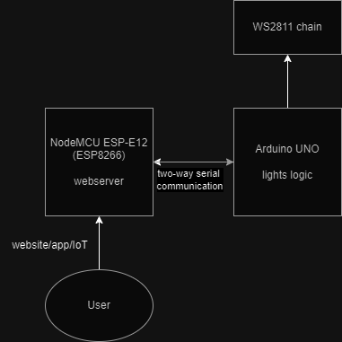

# FancyLights
___
## Overview
FancyLights is an Arduino project for controlling WS2811 LED strips via the Internet. Arduino UNO is connected to an ESP8266 module, on which is installed the [FancyLightsServer](https://github.com/kbolembach/FancyLightsServer). After logging into your network, it can be accessed via [esp8266.local](esp8266.local) with a zeroconf software such as [Bonjour](https://en.wikipedia.org/wiki/Bonjour_(software)) installed. 

This project was created using PlatformIO.

## Installation
1. Download [the server](https://github.com/kbolembach/FancyLightsServer) and upload it to the ESP8266.
2. Download this project and upload it to the Arduino.
3. Connect Arduino's software TX (pin 9) and RX (pin 8) to ESP8266's RX (pin 4) and TX (pin 5) respectively. Note: ESP8266 operates on 3.3V logic, and while it should handle 5V, be sure to use a logic converter.
4. Connect the WS2811 chain to Arduino - the data pin is 6. Remember that Arduino can't output more than 1A of current through the pins, so for full power use an external power supply.
5. Plug the Arduino to your PC via USB and run a serial monitor at 19200 BAUD rate. You'll be asked to input your network credentials to log in. You'll receive the server's IP adress.
Alternatively, you can use the [esp8266.local](esp8266.local) adress if you have [Bonjour](https://developer.apple.com/bonjour/) or another mDNS serivce set up.

## TODO
The project is in its base state now, and will be expanded with the following features:
- Add Google Home support,
- Log in to network via softAP instead of serial monitor (and use the hardware serial for communication between the two devices),
- Make the website prettier,
- Create a windows application alongside the website.